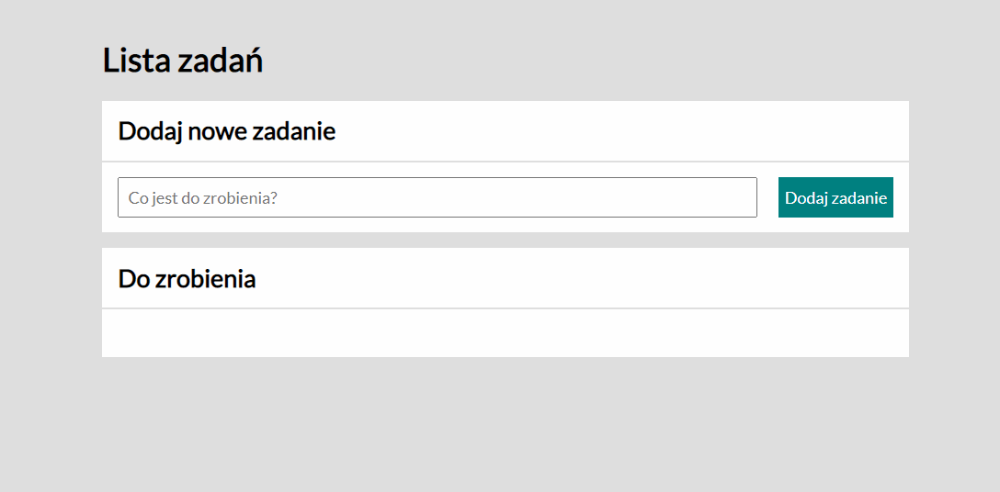

# toDoList
Hello, this simple toDoList is nothing unique. I made it for study purposes only. The list targets to polish users.
## Demo
https://pecet3.github.io/toDoList/
## technologies I used:
- HTML
- CSS
- CSS grid layout
- JavaScript Vanilla
- BEM Convention
## I fell in love with the CSS Grid during making this project
As you can see at the second animated screenshot the submit button is below the input area unlike the browser view. To get this effect I used CSS Grid and I loved it. I was thinking to use CSS flex, but Grid seemt the better and simpler option. I used Grid to style the tasks list as well.
## Animated Screenshot
### Browser 

### Phone

